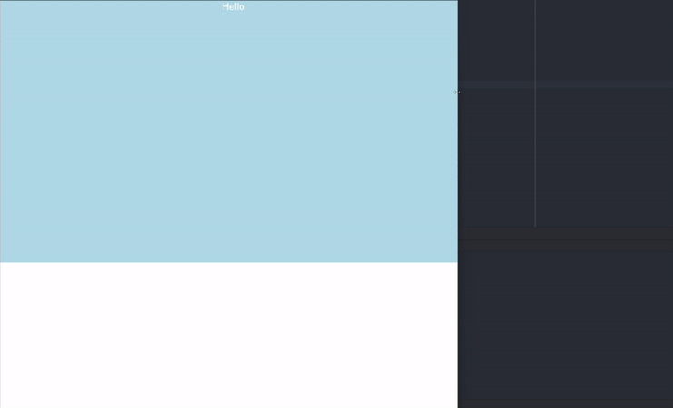

# Angular Aspect Ratio Container

Library to fix the aspect ratio of a container.

## Example

```html
<div class="wrapper" style="width: 100vw; height: 100vh">
  <div [ngAspectRatio]="16 / 9" style="background-color: lightblue">Hello</div>
</div>
```


