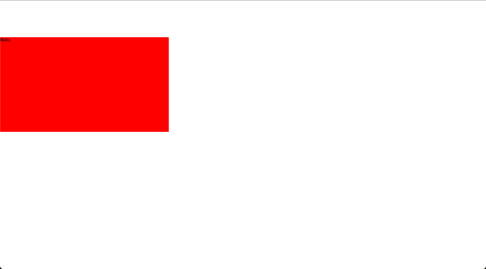

# Angular Aspect Ratio Container

Library to fix the aspect ratio of a container.

## Example

```html
<main style="width: 600px; height: 600px; display: flex; align-items: center">
  <div [ngAspectRatio]="16 / 9" style="background-color: red">Hello</div>
</main>
```


