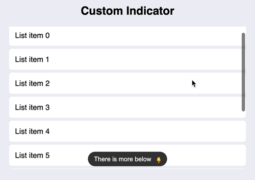
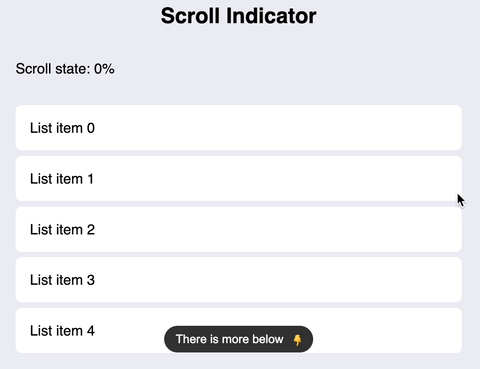

# angular-overflow-indicator

This library includes a simple and performant component that displays a given button if the content of the component overflows.

## Features

### Button that displays/hides accordingly



### Observe the scroll state




## Basic Usage

**Step 1: Install the package**

```console
yarn add angular-overflow-indicator
```
or
```console
npm install angular-overflow-indicator
```

**Step 2: Install the package**

```ts
import { ScrollViewWithIndicatorComponent } from 'angular-overflow-indicator';
```

**Step 3: Create a container with a maximum/fixed size**

```html
<div [style]="{ height: '300px', width: '500px' }">
 // ...
</div>
```

**Step 4: Add a template that includes the indicator-button**

```html
<div [style]="{ height: '300px', width: '500px' }">
  <ng-template #customButton>
    <button (click)="view.scrollToBottom()">There is more below <i>👇</i></button>
  </ng-template>
  
  // ...
</div>
```

**Step 5: Add the overflow-indicator-component with a list larger than the outer container and pass the template reference of the indicator-button**

```html

<div [style]="{ height: '300px', width: '500px' }">
  <ng-template #customButton>
    <button (click)="view.scrollToBottom()">There is more below <i>👇</i></button>
  </ng-template>

  <ng-scroll-view-with-indicator #view [indicatorButton]="customButton">
    <ul>
      @for (item of items(); track item) {
        <li>List item {{ item }}</li>
      }
    </ul>
  </ng-scroll-view-with-indicator>
</div>
```


